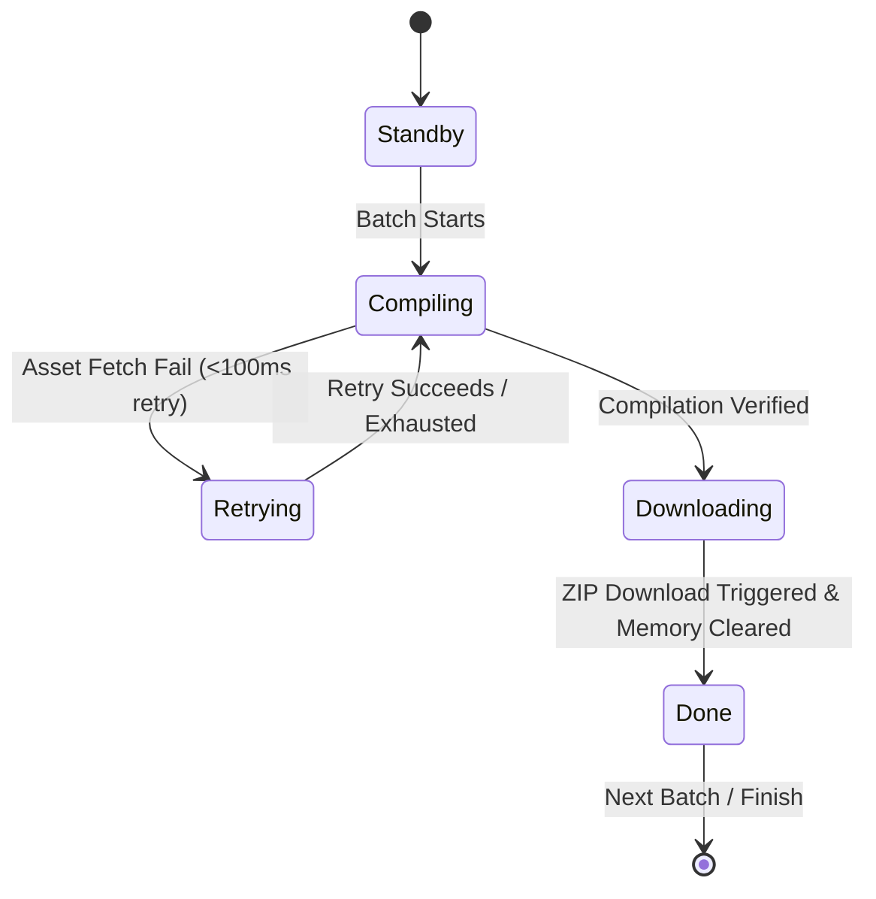
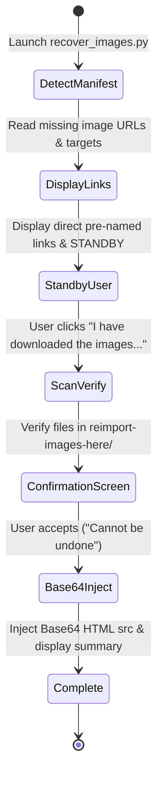
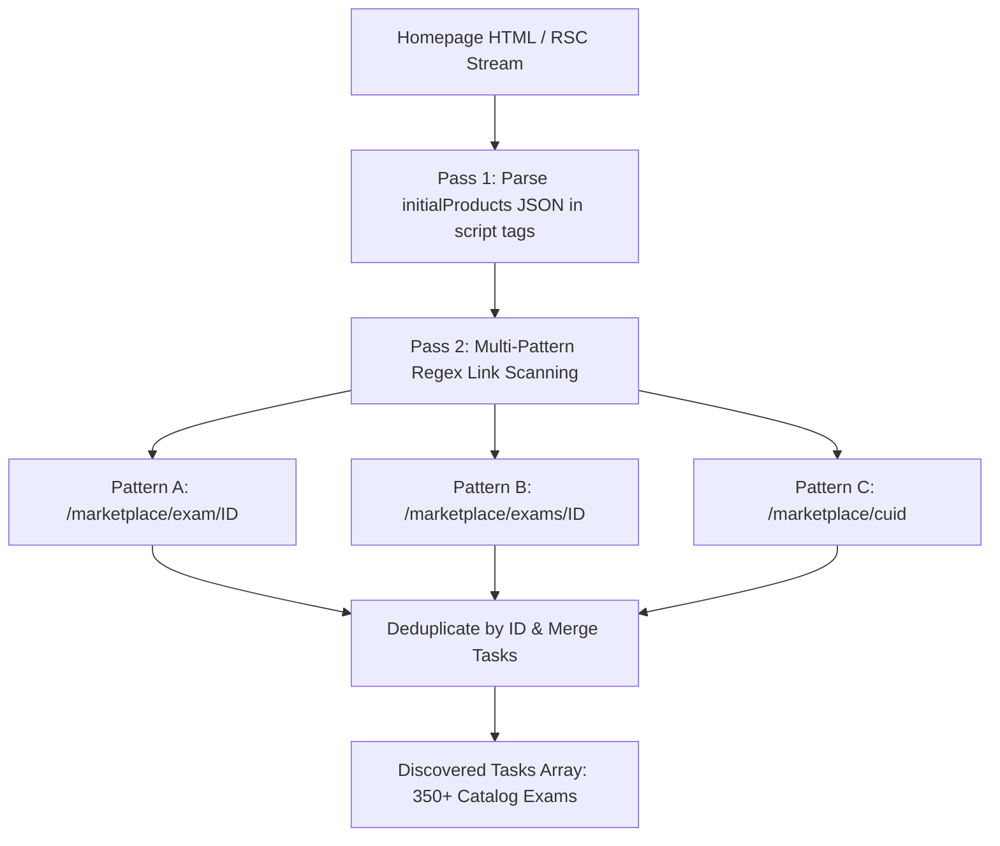

# Technical Design Specification: Batch ZIP Export Engine & Progress UI

## 1. Overview & Architectural Blueprint

This document details the architectural design for `fustation-tool`'s enhanced batch export engine, atomic volume partitioning, dual state machine progress tracking, slide-up footer UI component, Python TUI asset recovery system, homepage multi-pattern catalog endpoint hotfix, and header dual-switcher overflow / high-contrast log UI hotfixes.

```mermaid
flowchart TD
    UI[SavedTab / Overlay Component] -->|Trigger Batch Download| Engine[Atomic Batch Export Manager]
    Engine -->|Check Counter & Batch Index| StateMachine[Dual State Machine Controller]
    StateMachine -->|Update Header Pill| HeaderUI[Header Status Pill: Ready -> Processing -> Done]
    StateMachine -->|Update Footer UI| FooterUI[Slide-Up Footer: Standby -> Compiling -> Downloading -> Done]
    Engine -->|Compile Batch 0..Y-1| Compiler[Asset Fetcher & Compiler]
    Compiler -->|< 100ms Fast Retry (x3)| Fetcher[Network Fetcher]
    Fetcher -->|Fail After Retries| ManifestGen[Manifest & Recovery Generator]
    ManifestGen -->|FE Missing Images| PyRecovery[reimport-images-here/ & recover_images.py]
    ManifestGen -->|PE Missing Links| AuditManifest[manifest.md Direct Links]
    Compiler -->|Package Batch ZIP| JSZip[JSZip Engine]
    JSZip -->|Trigger Download & Free Memory| Browser[Browser Downloads]
```

---

## 2. Configuration & State Management

### Central Configuration
Defined in `src/config/constants.ts` or `src/utils/exporter.ts`:
```typescript
export const EXAMSETS_PER_BATCH = 50;
export const ASSET_RETRY_ATTEMPTS = 3;
export const ASSET_RETRY_DELAY_MS = 80;
```

### Batch Progress & Failsafe State Structure
```typescript
export type BatchStatus = 'standby' | 'compiling' | 'downloading' | 'done' | 'failed' | 'retrying';

export interface BatchProgressState {
  totalItems: number;
  completedItems: number;
  currentBatchIndex: number;
  totalBatches: number;
  batchStatus: BatchStatus;
  currentExamCode: string;
  currentLogNote: string;
  isPaused: boolean;
  isCanceled: boolean;
  isDrawerExpanded: boolean;
  logs: string[];
}
```

---

## 3. Dual State Machine & Color Coding System

### Header Status Pill (Overall Download Process)
- `Ready`: Initial selection active. Theme Light Purple (`var(--fus-status-ready)`).
- `Processing`: Download active, batches compiling/downloading. Theme Light Blue (`var(--fus-status-processing)`).
- `Done`: All batches complete and verified. Theme Light Green (`var(--fus-status-extracted)`).

### Footer Status Pill (Individual Batch State)
- `Standby`: Initial batch state. Theme Light Purple.
- `Compiling`: Active asset compiling.
  - Solid Light Blue during stable compiling.
  - Flashes Light Red (`var(--fus-status-error)`) on asset fetch failure.
  - Flashes Light Yellow (`#f59e0b` / theme yellow) during fast retry (<100ms delay).
- `Downloading`: Verified batch compilation, active ZIP blob download. Theme Light Blue.
- `Done`: Single batch complete. Theme Light Green.



---

## 4. Slide-Up Footer UI & Drawer Positioning Architecture (`ProgressFooter.tsx`)

### Position & Layout Rules
- **Footer Bar**: Statically anchored to the bottom of the main panel (`position: absolute/fixed`, `bottom: 0`, `left: 0`, `right: 0`, `z-index: 100`).
- **Animation**: Hidden by default (`transform: translateY(100%)`), slides up (`transform: translateY(0)`) when download starts.
- **Expandable Log Drawer**: Positioned **ALWAYS ABOVE THE FOOTER** (`bottom: var(--fus-footer-height, 56px)`). Toggling the Center Arrow Up button expands the log drawer upwards, overlaying the panel body while leaving the footer bar and its control buttons completely visible and accessible underneath.

### Theme-Centric High-Contrast Log Styling Rules
- Both `.fus-batch-log-box` and `.fus-footer-log-drawer` SHALL use theme-centric high-contrast token colors to ensure maximum legibility while adhering to theme styling:
  ```css
  background: var(--fus-layer-hover);
  color: var(--fus-text);
  font-weight: 500;
  border: 1px solid var(--fus-border);
  ```

```
+-----------------------------------------------------------------------------------+
| EXPANDABLE LOG DRAWER (Renders ALWAYS ABOVE the footer when ^ clicked)             |
| [THEME-CENTRIC HIGH-CONTRAST TOKENS var(--fus-layer-hover) & var(--fus-text)]      |
| [10:14:02] Batch 1 started (50 items)                                             |
| [10:14:03] PRF192: Image 14 fetch failed, retrying (attempt 2/3)...               |
+-----------------------------------------------------------------------------------+
|  LEFT CLUSTER (25%)   |            MIDDLE CLUSTER (55%)          | RIGHT CLUSTER (20%)|
| [12 / 120]            |                    [^]                       |  [Pause]  [Cancel] |
| [Batch 1/3] [Compiling]| [PRF192] Retrying asset (2/3)...            |                    |
+-----------------------------------------------------------------------------------+
```

---

## 5. Universal Manifest File (`manifest.md`) Standard

Every ZIP archive includes a `manifest.md` at the root:

```markdown
# [Title] Part X

## Examsets in this part:

1. [FE] PRF192_SP26_FE_01:
   Assets: none

2. [FE] PRO192_SP26_FE_01:
   Assets:
     Image [14]: Missing: https://www.fustation.net/api/exams/image?id=39201 (Target: reimport-images-here/batch01-rec-img-1.png)

3. [PE] PRN211_PE_SP26:
   Assets:
     PDF: Available
     ZIP: missing: https://www.fustation.net/api/exams/zip?productId=849201
```

---

## 6. Interactive Python TUI Image Recovery Script (`recover_images.py`)

Bundled in the root of any ZIP containing missing FE image assets alongside an empty `reimport-images-here/` directory.

### Interactive Multi-Stage TUI Workflow



1. **Stage 1: Manifest Detection & Direct Link Display**:
   - Parses local `manifest.md` to pinpoint missing FE image assets and target HTML files.
   - Displays direct HTTP/HTTPS download URLs with pre-named target filenames embedded in the link parameters (e.g. `https://www.fustation.net/api/exams/image?id=39201&filename=batch01-rec-img-1.png`).
2. **Stage 2: Interactive Standby State**:
   - The TUI pauses and STANDS BY for user manual downloads.
   - Displays interactive prompt/button: `[ I have downloaded the images and placed them into the folder ]`.
3. **Stage 3: Scan, Verification & Confirmation Screen**:
   - Once user confirms, the script scans `reimport-images-here/`, verifies file existence, match, and non-zero sizes.
   - Displays a confirmation summary listing mapped HTML replacements and warns: *"This operation cannot be undone."*
4. **Stage 4: Base64 Conversion & Inline Injection**:
   - Reads image files, converts them to `data:image/png;base64,...` strings.
   - Updates target HTML files inline.
   - Displays final status (`Success: X/Y, Failed: Z`) with Exit button.

---

## 7. Homepage Catalog Endpoint & Route Parser Hotfix Architecture

### Multi-Pattern Catalog Discovery Algorithm (`src/utils/batchFetcher.ts`)


1. **Pass 1 (`initialProducts` JSON Parsing)**: Extracts rich dataset objects (`title`, `subjectCode`, `id`) from Next.js RSC script pushes.
2. **Pass 2 (Unconditional Multi-Pattern Regex Scan)**: Scans HTML string across 3 route variations:
   - `/\/marketplace\/exam\/([a-zA-Z0-9_-]+)/g`
   - `/\/marketplace\/exams\/([a-zA-Z0-9_-]+)/g`
   - `/\/marketplace\/(cm[a-z0-9]{22,28})/g`
3. **Route Classifier Hotfix (`src/components/Overlay.tsx`)**:
   - Regex: `/\/marketplace\/(?:exam\/|exams\/)?[a-zA-Z0-9_-]+/`
   - Classifies `/marketplace/exam/{id}`, `/marketplace/exams/{id}`, and `/marketplace/{cuid}` as exam page routes.

---

## 8. Header Layout & Dual Format Switcher Hotfix Architecture

### Root Cause Analysis of Subtask 4.3 Clipping & Unclickability
1. **Vertical Clipping**: The fused matrix grid in `FormatSwitcher.tsx` was ~33px–35px tall. Inside `.fus-header` (which had `min-height: 48px`, `padding: 8px 10px 8px 12px`, leaving 32px content space), `align-items: center` centered the element such that the top and bottom 1.5px–2px overflowed `.fus-header` and `.fus-panel`'s `overflow: hidden`, truncating the lower `PE` row.
2. **Unclickable Interaction Disabling**: `.fus-header` defines `touch-action: none` for pointer drag listener handling. In `overlay.css`, rules only specified `.fus-header .fus-segmented-control { touch-action: auto; }`. Because `.fus-format-matrix` replaced `.fus-segmented-control`, pointer events on `.fus-matrix-grid-row` buttons were intercepted by the panel drag listener, rendering PE buttons unclickable!

### Comprehensive Solution Architecture
1. **Touch Action & Pointer Event Rule**: Add explicit CSS selector binding:
   ```css
   .fus-header .fus-format-matrix,
   .fus-header .fus-format-matrix * {
     touch-action: auto !important;
     pointer-events: auto !important;
   }
   ```
2. **Header Dynamic Height & Flex Padding**:
   Update `.fus-header` to `height: auto`, `min-height: 48px`, and `padding: 6px 10px 6px 12px` (giving 36px content space).
3. **Ultra-Compact Fused Grid**:
   Shave `.fus-matrix-grid-row` padding (`0px 1px` instead of `1px`) and adjust button height/font size (`font-size: 8px`, `padding: 1px 2px`) so total matrix height is **~26px–28px**, fitting comfortably inside any header container without clipping.
