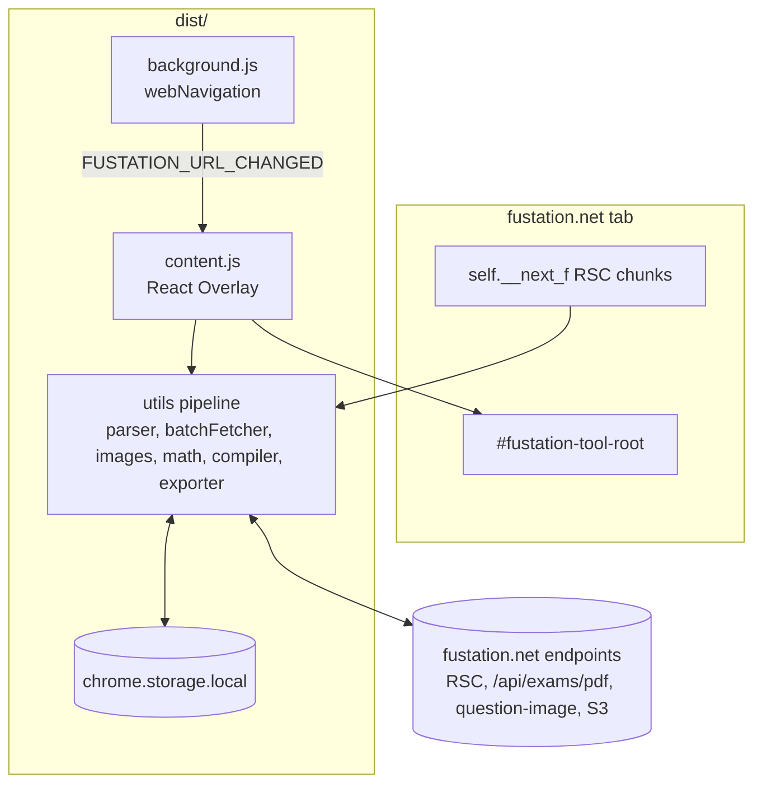

# Technical Design: fustation-tool

## 1. Overview

A Manifest V3 extension with two runtime contexts: a service worker (`src/background.ts`) that forwards SPA navigation events, and a content script (`src/content.tsx`) that mounts a React 18 overlay on `fustation.net`. The overlay orchestrates a pure-TypeScript data pipeline in `src/utils/` that extracts Next.js RSC payloads, normalizes them into `ExamDataset`, persists them to `chrome.storage.local`, enriches math and images, and exports MD, PDF, JSON, or ZIP.

Requirements: `requirements.md`. Layer rules: `docs/01-architecture-conventions.md`. Endpoints and error taxonomy: `docs/02-backend-conventions.md`.

## 2. Architecture

Standalone diagrams: `docs/diagrams/system-architecture.mmd`, `docs/diagrams/data-model.mmd`, `docs/flows/single-exam-extract.mmd`, `docs/flows/batch-fetch-and-bulk-export.mmd`.



## 3. Components and Interfaces

### A. Data Types (`src/types/index.ts`)
- `ExamDataset`: `id, title, subjectCode, subjectName, author, totalQuestions, questions` plus optional `campus, term, termCode, examType, examCategory ('FE'|'PE'), pdfUrl, zipUrl, examSessionTime, examSessionDate, parsedTitle, isPartial, successFetchCount, failedFetchCount`.
- `Question`: `index, id, text, imageUrl, imageBase64?, correctAnswers[], options[]`; `Option`: `id, text`.
- `SavedExamItem`: flattened metadata plus `extractedAt` and the full `dataset`; `SavedExamsMap = Record<string, SavedExamItem>`.
- Formats: `FEFormat = 'MD'|'PDF'|'JSON'`, `PEFormat = 'PE_PDF'|'PE_ZIP'|'PE_BOTH'`, `ExportFormat` is their union.
- Batch: `BatchItemTask`, `BatchState`, `BatchFetchStatus`; export progress: `BatchProgressState`, `AssetFetchResult`, `ManifestItemAudit`.
- UI: `ThemeName`, `PanelGeometry`, panel and viewer size constants, `ToastItem`.

### B. Parser (`src/utils/parser.ts`)
`getExamIdFromUrl`, `unescapeNextFChunk`, `tryParsePartialJson`, `formatExamDataset`, `extractExamFromScripts`, `manualRefetch`, `parseExamCode`, `sanitizeRscDate`, `decodeHtmlEntities`, `sanitizeOptionText`, `extractSessionTimeFromText`, `extractPeFromDOM`, `extractPeZipUrl`, `sanitizeAssetUrl`; deprecated fallback `crawlExamFromDOM`.

### C. Batch (`src/utils/batchFetcher.ts`)
`extractProductTasksFromHtml(html)` discovers tasks; `fetchExamDatasetDirect(task)` fetches `rscUrl` then `examUrl` with retry; `BatchFetchManager` singleton (`batchFetchManager`) exposes `subscribe, getState, setPreviewConfig, start, setPreviewIndex, proceedFromPreview, cancelPreview, togglePause, stop` and persists state.

### D. Enrichment (`images.ts`, `math.ts`, `highlight.ts`)
`normalizeImageUrl`, `fetchImageAsBase64`, `extractBase64FromDomImage`, `embedBase64ImagesInDataset`; `sanitizeMathLatex`, `hasMathLatex`, `renderMathInText`; `highlightText`, `containsQuery`.

### E. Compile & Export (`compiler.ts`, `exporter.ts`)
`compileMarkdown`; `exportExam(dataset, format)`; `generatePrintHtml`; `exportSinglePe`; `downloadPdfAsset`, `downloadZipAsset`, `downloadAssetUrl`; `resolveValidPdfUrl`, `extractNumericProductId`, `isPeDataset`; `fetchFreshPeZipUrl`, `fetchArrayBufferWithFastRetry`; `exportBulkAsZip(savedItems, optionsOrFeFormat?, maybePeFormat?)`, where `BulkExportOptions` carries the formats plus pause, cancel, and progress callback refs.

### F. Storage (`src/utils/storage.ts`)
Keys in `STORAGE_KEYS`: saved exams, active format, panel expanded, active tab, pending fetch, theme, panel geometry, viewer geometry, viewer open, reload attempted, batch state. Writes to saved exams go through `enqueueStorageTask` to serialize them.

### G. UI (`src/components/`, `src/hooks/`)
`Overlay` (route classification, 4-phase `runFetch`, message listener, tab and theme state), `ExtractTab`, `SavedTab`, `ViewerPanel`, `QuestionList`, `QuestionCard`, `MathText`, `ImageLightbox`, `FormatSwitcher`, `ProgressFooter`, `ScrollspyRail`, `ResizeHandles`, `Skeleton`, `ToastHost`, `Icons`; hooks `usePanelGeometry`, `useToasts`.

## 4. Data Models

See `docs/diagrams/data-model.mmd` and `docs/00-system-context.md` section 2 for the platform entities. The extension persists only `SavedExamItem` records and UI preferences; it holds no platform credentials.

## 5. Error Handling

Follows the taxonomy in `docs/02-backend-conventions.md` section 4. All failures surface through the toast queue or the batch log drawer; partial extraction is flagged with `isPartial` rather than padded.

## 6. Testing Strategy

- Fixture integration suite `tests/test-flow.ts` (`npm test`) runs parser, schema, math, image, PE asset, real bulk ZIP (FE and PE, mocked network), atomic delete, homepage discovery, and all-FE-fixture fidelity checks against captures in `docs/webfetches/`.
- `tsc --noEmit` for types; `scripts/build.js` verifies `dist/` contents after `vite build`.
- Manual in-browser checks: `ui-design/00-manual-testing-guide.md`. Endpoint checks: `api-design/00-verification-guide.md`.

## 7. Build & Directory Layout

```
fustation-tool/
├── src/
│   ├── manifest.json        # only shipped manifest
│   ├── background.ts        # -> dist/background.js
│   ├── content.tsx          # -> dist/content.js
│   ├── types/index.ts
│   ├── utils/               # examId, parser, batchFetcher, images, math, highlight, compiler, exporter, storage, panelCollision
│   ├── components/          # Overlay and children
│   ├── hooks/
│   └── styles/overlay.css
├── tests/                   # fixture integration suite
├── scripts/                 # build verification and analysis utilities (see scripts/README.md)
├── docs/                    # 00-05 conventions, ledger, issues, diagrams, flows, webfetch fixtures
├── specs/fustation-tool/fullstack/
└── dist/                    # build output, gitignored
```
